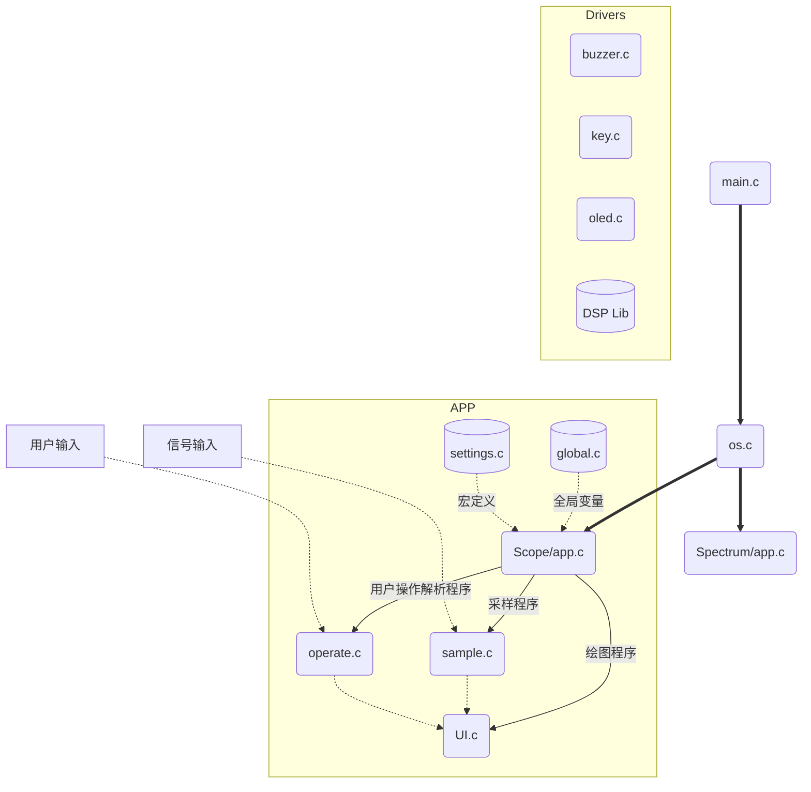

# 基于STM32G031的双通道示波器（带频谱分析功能）

采样率1MSa/s的双通道示波器、频谱仪。
示波器分析带宽为200kHz，支持时间、电压轴缩放，触发电平设置，触发边沿选择，触发通道选择。
频谱仪分析带宽为1MHz，支持频率、电压轴缩放。


## 1. 复现项目

首先需要硬禾学堂推出的STM32G031板卡，详情：https://www.eetree.cn/project/detail/662

### 方法一：烧录bin文件

1. 下载最新版的bin文件：https://github.com/xzqiaochu/scope/releases
2. 使用STM32CubeProgrammer烧录（建议使用2.8.0；不要使用2.9.0，该版本部分字节存在烧写错误；更高版本暂不知晓是否可用）。

### 方法二： 本地编译

1. 环境配置

   项目采用STM32CubeMX + CLion开发，请参考这篇文章配置环境：https://zhewana.cn/2021/c69c321f18aa/

   注：上述文章暂时失效，替代文章：https://www.bilibili.com/read/cv6308000 | https://zhuanlan.zhihu.com/p/160183640

2. 编译

   使用STM32CubeMX打开 scope.ioc，点击 GENGERATE CODE；

   使用CLion打开工程，第一次打开会弹出CMake配置选项卡，新建一个Release配置；

   稍后会弹出面板配置文件选项卡，点击取消；

   打开编辑/调试配置，更改面板配置文件为当前项目根目录下的st_nucleo_g0.cfg；

   使用ST-Link连接板卡，编译下载程序。


## 2. 项目需求

##### **设计一个带频谱分析功能的双通道示波器**

1. 通过STM32G031的ADC采集外部模拟信号，信号幅度范围2mVpp到30Vpp，频率为DC - 50KHz
2. 将采集到的波形显示在128*128的OLED上，并支持电平**触发**的功能
3. 通过FFT进行频谱分析，并将频谱显示在OLED上
4. 测试信号可以通过芯片的PWM+板上LPF的方式产生，比如1KHz、幅度为3V的正弦波
5. 能够自动测量波形的参数 - 峰峰值、平均值、频率/周期
6. 能够通过按键和旋转编码器来对波形进行幅度和时间轴缩放查看


## 3. 完成的功能及达到的性能

### 示波器部分

1. **双通道波形显示**

   可同时显示两个通道的波形，每个通道的最大采样率为$1MSa/s$，最大分析带宽约为$200kHz$。

2. **时间轴、电压轴缩放**

   可使用旋转编码器调整时间轴、电压轴刻度；程序会根据选择的时间轴刻度，自动计算合适的采样率。

   时间轴刻度(/div)有：

   ```c
   "100ms",
   "50ms", "20ms", "10ms",
   "5ms", "2ms", "1ms",
   "500us", "200us", "100us",
   "50us", "20us", "10us",
   "5us", "2us", "1us"
   ```

   电压轴刻度(/div)有：

   ```c
   "5V", "2V", "1V",
   "500mV", "200mV", "100mV"
   ```

3. **触发电平设置**

   可使用旋转编码器调整触发电平，触发电平以0.5div步进。时间轴缩放可能导致触发电平不能以0.5div对齐，但程序会保证：每次用户调整电平时，将就近以0.5div对齐。

   触发电平有上下限保护，当用户试图将触发电平调离屏幕显示区域时，程序会阻止并发出提示音。

   时间轴的缩放同样可能导致触发电平偏离屏幕区域，当出现这种情况时，程序将采取以下逻辑：

   - 若用户没有调整触发电平，触发电平的值将保持，绘图程序不会绘制触发电平
   - 若用户尝试调整触发电平，程序会将触发电平首先调整为临近上限/下限的值（就近选择）

4. **触发边沿选择**

   可选择上升沿/下降沿触发。

5. **触发通道选择**

   可选择通道1/通道2作为触发通道。

6. **波形保持**

   按下hold按键，波形将停止刷新，并保持最后一个波形。

   但采样程序、波形参数计算程序会持续运行，当用户解除hold时，将立刻绘制出最后一次采样的波形、信息。（此功能对于诸如100ms/div的大时间刻度十分凑效，可避免长时间采样所带来的等待时间）

### 频谱仪部分

1. **双通道频谱显示**

   可同时显示两个通道的频谱，每个通道的频率范围最大为$DC$$ - $$1MHz$。

2. **频率轴、电压轴缩放**

   可使用旋转编码器调整频率轴最大值、电压轴刻度；程序会根据选择的频率轴，自动计算合适的采样率。

   频率轴最大值有：

   ```c
   "100Hz", "200Hz", "500Hz",
   "1kHz", "2kHz", "5kHz",
   "10kHz", "20kHz", "50kHz",
   "100kHz", "200kHz", "500kHz",
   "1MHz"
   ```

   电压轴刻度(/div)有：

   ```c
   "5V", "2V", "1V",
   "500mV", "200mV", "100mV"
   ```

3. **波形保持**

   按下hold按键，波形将停止刷新，并保持最后一个波形。

   但采样程序、FFT程序会持续运行，当用户解除hold时，将立刻绘制出最后一次采样的频率、信息。

   

## 4. 实现过程

### 程序结构

程序采用APP编写，示波器(Scope)、频谱仪(Spectrum) 为两个APP；每个APP均有 `Init()、DeInit()、Loop()` 函数。`os.c`为用户主程序，用来控制APP的运行，并连接Drivers层和APP层。

Drivers层：更关注硬件上的实现，为APP层提供函数接口；

APP层：更关注算法，尽可能避免硬件相关操作，增强移植性。



频谱仪(Spectrum)的结构与示波器(Scope)的结构一致，上图省略未画出。

值得一提的是，对于占用大量内存的全局变量（尤其是数组），APP采用动态申请内存的方式：`Init()`中函数使用`malloc()`申请内存，`DeInit()`中使用`free()`释放内存。这样大量节省了RAM空间。

## 核心算法

主要思路：使用STM32G031内置的ADC进行采样，并使用DMA完成数据搬运；主程序专注于处理采样数据和绘图。

1. **ADC+DMA采样**

   使用STM32CubeMX配置ADC的触发源为TIM的TRGO事件，并开启DMA。

   程序对采样数据进行乒乓缓存，每个样本缓冲区有3种状态：未采样(Not)，正在采样(Doing)，完成采样(Finished)。

   核心函数如下：（位置：APP/Scope/sample.c）

   ```c
   // 尝试开启一次DMA传输
   // 调用位置：DMA全传输完成中断、UI绘图消耗掉一组数据、重新设置采样率
   void Scope_Sample_Try_Start_New_ADC(void) {
       static uint8_t busy; // 该函数可能被主函数、中断同时调用，设置标注变量，防止同时调用执行
       if (busy == 1)
           return;
       busy = 1;
   
       if (!dma_busy) { // 检查DMA是否正在工作
           for (uint8_t i = 0; i < SCOPE_MAX_CACHE; i++) {
               if (scope_sample_arr[i] == NULL)
                   break;
               if (scope_sample_arr[i]->sample_flag == Scope_Sample_Not) { // 找到一个未采样(Not)的采样缓冲区
                   dma_busy = 1;
                   scope_sample_arr[i]->sample_flag = Scope_Sample_Doing;
                   HAL_ADC_Start_DMA(&SCOPE_hadc, (uint32_t *) scope_sample_arr[i]->data, SCOPE_SAMPLE_NUM * SCOPE_CHANNEL_NUM);
                   HAL_TIM_Base_Start(&SCOPE_htim);
                   break;
               }
           }
       }
   
       busy = 0;
   }
   
   // DMA全传输完成中断回调函数
   void Scope_Sample_ADC_ConvCpltCallback(ADC_HandleTypeDef *hadc) {
       UNUSED(hadc);
       HAL_TIM_Base_Stop(&SCOPE_htim);
       HAL_ADC_Stop_DMA(&SCOPE_hadc);
       dma_busy = 0;
       for (uint8_t i = 0; i < SCOPE_MAX_CACHE; i++) {
           if (scope_sample_arr[i]->sample_flag == Scope_Sample_Doing) {
               scope_sample_arr[i]->sample_flag = Scope_Sample_Finished;
               break;
           }
       }
       Scope_Sample_Try_Start_New_ADC();
   }
   ```

2. **采样数据处理**

   示波器数据处理：遍历样本缓冲区，计算最大值、最小值、平均值；找到所有的边沿，计算周期/频率；把最靠中间的上升沿（下降沿）作为0时刻。

   核心函数如下：（位置：APP/Scope/sample.c）

   ```c
   // 处理采样数据
   // 计算：最大值、最小值、平均值、周期、绘图数据
   // 返回值：表示是否触发且数据量充足
   static uint8_t Scope_Sample_Process_Sub(Scope_Sample *sample) {
       uint8_t rst;
   
       for (uint8_t k = 0; k < SCOPE_CHANNEL_NUM; k++) {
           // 计算最小值、最大值、平均值
           uint16_t min = UINT16_MAX, max = 0;
           float avg;
           uint32_t sum = 0;
           for (uint16_t i = 0; i < SCOPE_SAMPLE_NUM; i++) {
               if (sample->data[i][k] > max) max = sample->data[i][k];
               if (sample->data[i][k] < min) min = sample->data[i][k];
               sum += sample->data[i][k];
           }
           avg = (float) sum / SCOPE_SAMPLE_NUM;
           // 因输入反相，输入最大值为数据最小值
           sample->vpp[k] = toVoltage(min) - toVoltage(max);
           sample->avg[k] = toVoltage(avg);
   
           // 找到所有的上升沿、下降沿
           float tri_data = toData(scope_tri_voltage);
           uint16_t edges[2][SCOPE_MAX_EDGE];
           uint16_t edges_cnt[2] = {0};
           for (uint16_t i = SCOPE_TRI_CHECK_NUM; i < (uint16_t) (SCOPE_SAMPLE_NUM - SCOPE_TRI_CHECK_NUM); i++) {
               // 检测数据上升沿
               uint8_t cnt = 0;
               for (uint8_t j = 1; j <= SCOPE_TRI_CHECK_NUM; j++) {
                   if ((float) sample->data[i - j][k] < tri_data && (float) sample->data[i + j][k] > tri_data)
                       cnt++;
                   else
                       break;
               }
               if (cnt == SCOPE_TRI_CHECK_NUM && (float) sample->data[i][k] < tri_data) {
                   edges[Scope_Edge_Rise][edges_cnt[Scope_Edge_Rise]++] = i;
                   if (edges_cnt[Scope_Edge_Rise] >= SCOPE_MAX_EDGE) { // 边沿数超出上限
                       edges_cnt[Scope_Edge_Rise] = edges_cnt[Scope_Edge_Fall] = 0;
                       break;
                   }
               }
   
               // 检查数据下降沿
               cnt = 0;
               for (uint8_t j = 1; j <= SCOPE_TRI_CHECK_NUM; j++) {
                   if ((float) sample->data[i - j][k] > tri_data && (float) sample->data[i + j][k] < tri_data)
                       cnt++;
                   else
                       break;
               }
               if (cnt == SCOPE_TRI_CHECK_NUM && (float) sample->data[i][k] > tri_data) {
                   edges[Scope_Edge_Fall][edges_cnt[Scope_Edge_Fall]++] = i;
                   if (edges_cnt[Scope_Edge_Fall] >= SCOPE_MAX_EDGE) { // 边沿数超出上限
                       edges_cnt[Scope_Edge_Rise] = edges_cnt[Scope_Edge_Fall] = 0;
                       break;
                   }
               }
           }
   
           // 计算周期
           float cycle = 0.0f;
           if (edges_cnt[Scope_Edge_Rise] > 1 && edges_cnt[Scope_Edge_Fall] > 1) {
               float cycle1 =
                       (float) (edges[Scope_Edge_Rise][edges_cnt[Scope_Edge_Rise] - 1] - edges[Scope_Edge_Rise][0]) /
                       (float) (edges_cnt[Scope_Edge_Rise] - 1);
               float cycle2 =
                       (float) (edges[Scope_Edge_Fall][edges_cnt[Scope_Edge_Fall] - 1] - edges[Scope_Edge_Fall][0]) /
                       (float) (edges_cnt[Scope_Edge_Fall] - 1);
               cycle = (cycle1 + cycle2) / 2;
           } else if (edges_cnt[Scope_Edge_Rise] > 1) {
               float cycle1 =
                       (float) (edges[Scope_Edge_Rise][edges_cnt[Scope_Edge_Rise] - 1] - edges[Scope_Edge_Rise][0]) /
                       (float) (edges_cnt[Scope_Edge_Rise] - 1);
               cycle = cycle1;
           } else if (edges_cnt[Scope_Edge_Fall] > 1) {
               float cycle2 =
                       (float) (edges[Scope_Edge_Fall][edges_cnt[Scope_Edge_Fall] - 1] - edges[Scope_Edge_Fall][0]) /
                       (float) (edges_cnt[Scope_Edge_Fall] - 1);
               cycle = cycle2;
           }
           sample->freq[k] = toFreq(cycle);
   
           // Channel1为触发通道
           if (k == scope_tri_channel) {
               // 选取最佳触发位置：最居中的触发位置
               uint16_t min_diff = UINT16_MAX, min_diff_p = 0;
               for (uint16_t i = 0; i < edges_cnt[!scope_tri_edge]; i++) { // 因输入反相，输入上升沿是数据下降沿
                   int diff = abs((int) edges[!scope_tri_edge][i] * 2 - SCOPE_SAMPLE_NUM);
                   if (diff < min_diff) {
                       min_diff = diff;
                       min_diff_p = edges[!scope_tri_edge][i];
                   }
               }
               uint16_t tri_p = min_diff_p;
   
               // 检查是否有足够的数据用于绘图
               uint16_t max_len = Min(tri_p, SCOPE_SAMPLE_NUM - tri_p) * 2;
               // 采样率 * 示波器横轴总时间 = 所需样本数
               uint16_t need_len = (uint16_t) (
                       scope_sample_rate / 1000.0f * (scope_ms_div[scope_ms_div_select] * SCOPE_X_GRID) + 0.5f);
               if (max_len < need_len || min_diff_p == 0) { // min_diff_p == 0 说明边沿数为0（也有可能是因为超出上限而被置为0）
                   tri_p = need_len / 2;
                   rst = 0;
               } else {
                   rst = 1;
               }
   
               // 标记有效绘图数据在原数组中的位置
               sample->sp = tri_p - need_len / 2;
               sample->len = need_len;
           }
   
       }
   
       return rst;
   }
   ```

   频谱仪数据处理：是用DSP库进行FFT。为了节省空间，采样数组和FFT数组共用同一个，但需要进行位对齐、转置。

   核心代码如下：（位置：APP/Spectrum/sample.c）

   ```c
   // 处理采样数据：FFT
   // 计算：最大峰频率、绘图数据
   static void Spectrum_Sample_Handle_Sub(Spectrum_Sample *sample) {
       uint16_t *p16 = (uint16_t *) sample->data;
       uint64_t *p64 = (uint64_t *) sample->data;
   
       // uint16_t转uint64_t
       for (int16_t i = SPECTRUM_SAMPLE_NUM * SPECTRUM_CHANNEL_NUM - 1;
            i >= 0; i--) { // 倒序循环，不可以用unsigned，否则0-1=MAX，永远无法退出循环
           float *tmp_p = (float *) &p64[i];
           tmp_p[0] = toVoltage((float) p16[i]); // 实部放在前32位
           tmp_p[1] = 1; // 虚部为0；这里标为1，是为下一步行列转换做准备
       }
   
       // 行列转置
   #define REAL(x) (*((float *) &p64[x]))
   #define IMAGE(x) (*((float *) &p64[x] + 1))
   #define NEXT(x) ((p % SPECTRUM_CHANNEL_NUM) * SPECTRUM_SAMPLE_NUM + (p / SPECTRUM_CHANNEL_NUM))
       for (uint16_t i = 0; i < (uint16_t) (SPECTRUM_SAMPLE_NUM * SPECTRUM_CHANNEL_NUM); i++) {
           if (IMAGE(i) == 0)
               continue;
           uint16_t first_p = i;
           uint16_t p = i;
           float val = REAL(i);
           IMAGE(i) = 0;
           while (1) {
               p = NEXT(p);
               if (p == first_p) {
                   REAL(p) = val;
                   break;
               }
               float tmp = REAL(p);
               REAL(p) = val;
               val = tmp;
               IMAGE(p) = 0;
           }
       }
   #undef REAL
   #undef IMAGE
   #undef NEXT
   
       for (uint8_t k = 0; k < SPECTRUM_CHANNEL_NUM; k++) {
           float *fft = sample->data[k];
   
           arm_cfft_f32(&arm_cfft_sR_f32_len, fft, 0, 1);
           arm_cmplx_mag_f32(fft, fft, SPECTRUM_SAMPLE_NUM); // magnitude为模长；fft前一半为正模长，后一半为负模长
   
           // 计算最大峰
           float FFT_max;
           uint32_t FFT_max_index;
           float freq = 0;
           arm_max_f32(fft + 1, SPECTRUM_SAMPLE_NUM / 2 - 1, &FFT_max, &FFT_max_index); // 只考虑正模长
           FFT_max_index++; // 过滤掉直流分量
           if (FFT_max_index >= 2) {
               float sum = fft[FFT_max_index - 2] +
                           fft[FFT_max_index - 1] +
                           fft[FFT_max_index] +
                           fft[FFT_max_index + 1] +
                           fft[FFT_max_index + 2];
               freq = (((float) (FFT_max_index - 2) * fft[FFT_max_index - 2]) +
                       ((float) (FFT_max_index - 1) * fft[FFT_max_index - 1]) +
                       ((float) (FFT_max_index) * fft[FFT_max_index]) +
                       ((float) (FFT_max_index + 2) * fft[FFT_max_index + 2]) +
                       ((float) (FFT_max_index + 1) * fft[FFT_max_index + 1])) / sum;
               freq *= (spectrum_KHz_max[spectrum_KHz_max_select] * (1000.0f / (SPECTRUM_SAMPLE_NUM / 2.0f))); // 比例算法
           }
           sample->freq[k] = freq; // 最大峰频率
           sample->max[k] = fft[FFT_max_index] / (SPECTRUM_SAMPLE_NUM / 2.0f); // 最大峰电压
   
           // 计算直流分量
           fft[0] /= 2; // 除直流分量外，其他分量被镜像了一份；所以从数值上看，应该把直流分量/2
           sample->bias[k] = fft[0] / (SPECTRUM_SAMPLE_NUM / 2.0f);
       }
   }
   ```

   
